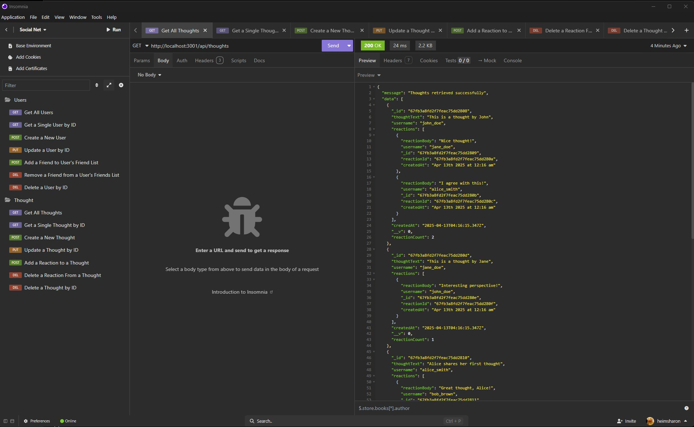

# Social Network API

_A RESTful backend for a social networking platform, featuring user accounts, thoughts, reactions, and friend management. Built with Node.js, Express, TypeScript, and MongoDB._


---

## Table of Contents

-   [Social Network API](#social-network-api)
    -   [Table of Contents](#table-of-contents)
    -   [Description](#description)
    -   [Features](#features)
    -   [Prerequisites](#prerequisites)
    -   [Technologies Used](#technologies-used)
    -   [Quick Start](#quick-start)
    -   [Installation](#installation)
    -   [API Documentation](#api-documentation)
    -   [Usage](#usage)
    -   [Media](#media)
        -   [Screen Capture of API endpoints in Insomnia](#screen-capture-of-api-endpoints-in-insomnia)
        -   [Video Demonstration](#video-demonstration)
    -   [License](#license)
    -   [Notes](#notes)
    -   [Contributing, Support, and FAQ](#contributing-support-and-faq)
    -   [Acknowledgments](#acknowledgments)
    -   [Author](#author)

---

## Description

The Social Network API is a backend service that enables users to register, share thoughts, react to posts, and manage friend relationships. Designed for flexibility and scalability, it leverages Node.js, Express, TypeScript, and MongoDB (with Mongoose) to provide robust data modeling, validation, and error handling. This API is ideal for learning backend development, RESTful design, and NoSQL data structures.

---

## Features

-   User registration and management
-   CRUD operations for thoughts
-   Add and remove friends
-   React to thoughts (add/remove reactions)
-   Virtual properties for friend and reaction counts
-   Data validation and error handling
-   Seed script for populating the database with sample data

---

## Prerequisites

-   [Node.js](https://nodejs.org/) (v18 or higher)
-   [npm](https://www.npmjs.com/) (comes with Node.js)
-   [MongoDB](https://www.mongodb.com/) (local or cloud)
-   [Git](https://git-scm.com/) (for cloning)

---

## Technologies Used

-   [Node.js](https://nodejs.org/)
-   [Express.js](https://expressjs.com/)
-   [TypeScript](https://www.typescriptlang.org/)
-   [MongoDB](https://www.mongodb.com/)
-   [Mongoose](https://mongoosejs.com/)
-   [dotenv](https://github.com/motdotla/dotenv)
-   [moment](https://momentjs.com/)

---

## Quick Start

> You can get the code by either cloning this repository using Git, or downloading it as a ZIP file from GitHub (click the green "Code" button, then "Download ZIP").
> On GitHub, you can also browse the code, view commit history, open issues, and submit pull requests.

---

## Installation

1. **Clone the repository:**

    ```bash
    git clone <repository-url>
    cd social-network-api
    ```

2. **Install dependencies:**

    ```bash
    npm install
    ```

3. **Set up environment variables:**

    Create a `.env` file in the root directory with the following content:

    ```env
    MONGODB_URI=mongodb://localhost:27017/socialNetworkDB
    PORT=3001
    ```

    > **Note:** Never commit your real `.env` file to version control. Only commit `.env.example` with placeholder values.

4. **Build the TypeScript files:**

    ```bash
    npm run build
    ```

5. **Seed the database (optional):**

    ```bash
    npm run seed
    ```

6. **Start the server:**

    - **Development mode:**

        ```bash
        npm run dev
        ```

    - **Production mode:**

        ```bash
        npm start
        ```

    The API will be available at [http://localhost:3001](http://localhost:3001)

---

## API Documentation

See [API.md](./API.md) for a full list of available endpoints and usage examples.

---

## Usage

1. Use an API client like [Insomnia](https://insomnia.rest/) or [Postman](https://www.postman.com/) to interact with the endpoints.
2. Create users, add thoughts, add friends, and react to thoughts using the documented endpoints in [API.md](./API.md).
3. Use the seed script to populate the database with sample users and thoughts for testing.

---

## Media

### Screen Capture of API endpoints in Insomnia



### Video Demonstration

A video walkthrough of the project, including setup and API usage, can be found [here](https://drive.google.com/file/d/12LKGpaz_1yW08DYpy_faghj0fJR8uJ7u/view?usp=drive_link).

---

## License

This project is licensed under the [MIT License](https://opensource.org/licenses/MIT).

You are free to use, modify, and distribute this software for personal or commercial purposes, provided you include the original copyright
and license notice in any copies or substantial portions of the software.

See the [MIT License text](https://opensource.org/licenses/MIT) for full details.

---

## Notes

-   The codebase is written in TypeScript and is heavily commented for clarity.
-   The repository includes a seed script for quickly populating the database with sample data.
-   All environment variables should be stored in a `.env` file and never committed to version control.

---

## Contributing, Support, and FAQ

-   **Contributions:** Pull requests are welcome! Please open an issue or submit a pull request for improvements or bug fixes.
-   **Support:** If you encounter any issues or have suggestions, please open an issue on GitHub.
-   **FAQ:**
    -   _How do I run the program?_
        See the [Installation](#installation) and [Usage](#usage) sections above.
    -   _Can I use this for my own project?_
        Yes, this project is MIT licensed. See the [License](#license) section.
    -   _I'm having trouble connecting to the database or running the app!_
        -   Double-check your `.env` file values, especially `MONGODB_URI`.
        -   Make sure MongoDB is running and accessible.
        -   Try running `npm install` if you see missing module errors.
        -   If you need to reset the database, you can re-run the seed command:
            ```bash
            npm run seed
            ```

---

## Acknowledgments

Portions of this project were developed using starter code provided by [edX Boot Camps LLC](https://bootcamp.edx.org/) for educational purposes.

---

## Author

Created by Sharon Heim.
For questions or suggestions, please visit my [GitHub profile](https://github.com/heimsharon).

---

© 2024 Social Network API Project
